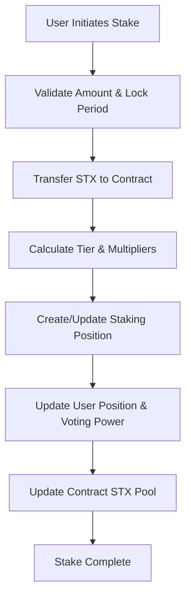
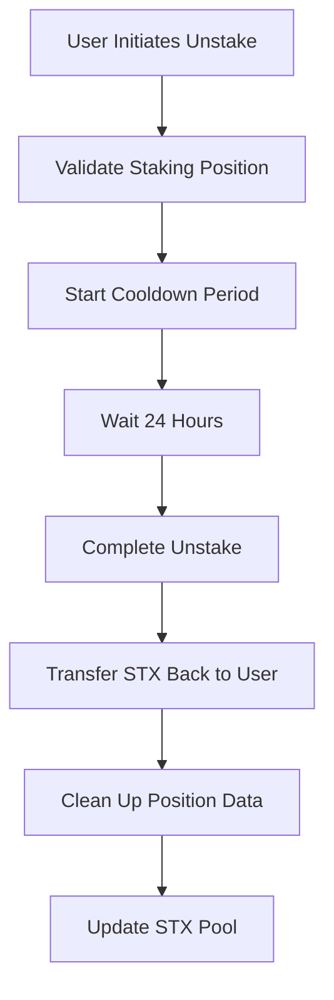
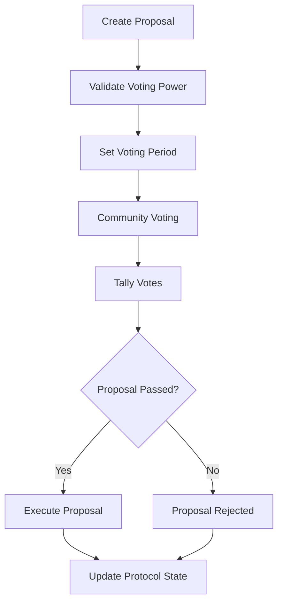

# BitStake Protocol

> **Decentralized Bitcoin-Native Staking & Governance Protocol**

BitStake Protocol is a sophisticated liquid staking solution built on Stacks, enabling STX holders to earn yield while participating in decentralized governance within Bitcoin's Layer 2 ecosystem.

## 🚀 Key Features

- **Multi-Tier Staking System** - Bronze, Silver, and Gold tiers with escalating rewards
- **Time-Lock Bonuses** - Enhanced yields for longer commitment periods
- **Liquid Staking** - Maintain liquidity while earning staking rewards
- **Decentralized Governance** - Community-driven protocol decisions
- **Bitcoin-Native Design** - Built specifically for the Bitcoin/Stacks ecosystem
- **Emergency Safeguards** - Robust security controls and pause functionality

## 📊 System Overview

BitStake Protocol operates as a decentralized autonomous organization (DAO) where users stake STX tokens to earn BITSTAKE governance tokens. The protocol implements a sophisticated tier system that rewards larger stakes and longer commitments with enhanced yields and governance privileges.

### Tier Structure

| Tier | Minimum Stake | Reward Multiplier | Features |
|------|---------------|-------------------|----------|
| **Bronze** | 1 STX | 1.0x | Basic staking |
| **Silver** | 5 STX | 1.5x | Enhanced rewards + governance |
| **Gold** | 10 STX | 2.0x | Premium features + priority governance |

### Lock Period Bonuses

- **No Lock**: 1.0x multiplier
- **30 Days**: 1.25x multiplier
- **60+ Days**: 1.5x multiplier

## 🏗️ Contract Architecture

```
BitStake Protocol
├── Core Components
│   ├── Staking Engine
│   │   ├── Stake Management
│   │   ├── Reward Calculation
│   │   └── Tier Assignment
│   ├── Governance Module
│   │   ├── Proposal Creation
│   │   ├── Voting Mechanism
│   │   └── Execution Logic
│   └── Security Layer
│       ├── Access Control
│       ├── Emergency Pause
│       └── Cooldown Management
└── Data Structures
    ├── UserPositions
    ├── StakingPositions
    ├── Proposals
    └── TierLevels
```

### Core Data Structures

#### UserPositions

Comprehensive user account data including stake amounts, tier levels, and voting power.

```clarity
{
  total-collateral: uint,
  total-debt: uint,
  health-factor: uint,
  last-updated: uint,
  stx-staked: uint,
  analytics-tokens: uint,
  voting-power: uint,
  tier-level: uint,
  rewards-multiplier: uint
}
```

#### StakingPositions

Individual staking position details with lock periods and reward tracking.

```clarity
{
  amount: uint,
  start-block: uint,
  last-claim: uint,
  lock-period: uint,
  cooldown-start: (optional uint),
  accumulated-rewards: uint
}
```

#### Proposals

Governance proposal structure for community decision-making.

```clarity
{
  creator: principal,
  description: (string-utf8 256),
  start-block: uint,
  end-block: uint,
  executed: bool,
  votes-for: uint,
  votes-against: uint,
  minimum-votes: uint
}
```

## 🔄 Data Flow

### Staking Process



### Unstaking Process



### Governance Flow



## 🛠️ Technical Specifications

### Network Compatibility

- **Blockchain**: Stacks (Bitcoin Layer 2)
- **Token Standard**: SIP-010 Fungible Token
- **Language**: Clarity Smart Contract Language

### Security Features

- **Access Control**: Owner-only administrative functions
- **Emergency Pause**: Contract-wide pause functionality
- **Cooldown Periods**: 24-hour unstaking delay
- **Input validation**: Comprehensive parameter validation

### Configuration Parameters

- **Base Reward Rate**: 5% annual (adjustable)
- **Minimum Stake**: 1 STX
- **Cooldown Period**: 1440 blocks (~24 hours)
- **Max Voting Period**: 2880 blocks (~20 days)

## 📋 Usage

### Staking STX

```clarity
;; Stake 5 STX with 30-day lock period
(contract-call? .bitstake-protocol stake-stx u5000000 u4320)
```

### Creating Proposals

```clarity
;; Create governance proposal
(contract-call? .bitstake-protocol create-proposal 
  u"Increase reward rate to 6%" 
  u1440)
```

### Voting on Proposals

```clarity
;; Vote in favor of proposal #1
(contract-call? .bitstake-protocol vote-on-proposal u1 true)
```

## 🔒 Security Considerations

- **Smart Contract Audits**: Recommended before mainnet deployment
- **Access Control**: Critical functions restricted to contract owner
- **Emergency Controls**: Pause functionality for crisis situations
- **Input Validation**: All user inputs validated before processing
- **Reentrancy Protection**: Safe STX transfer patterns implemented

## 🚀 Deployment

### Prerequisites

- Stacks development environment
- Clarinet CLI tool
- STX tokens for gas fees

### Deployment Steps

1. **Initialize Contract**

   ```bash
   clarinet deploy --network testnet
   ```

2. **Initialize Tier System**

   ```clarity
   (contract-call? .bitstake-protocol initialize-contract)
   ```

3. **Verify Deployment**

   ```clarity
   (contract-call? .bitstake-protocol get-contract-owner)
   ```

## 📊 Monitoring & Analytics

### Key Metrics

- **Total Value Locked (TVL)**: Total STX staked in protocol
- **Active Stakers**: Number of unique staking positions
- **Governance Participation**: Voting activity and proposal creation
- **Tier Distribution**: Breakdown of users across tier levels

### Read-Only Functions

- `get-stx-pool`: Current total STX locked
- `get-user-position`: Individual user statistics
- `get-proposal-details`: Governance proposal information
- `is-contract-paused`: Contract operational status

## 🤝 Contributing

BitStake Protocol welcomes community contributions. Please follow these guidelines:

1. **Code Style**: Follow Clarity best practices
2. **Testing**: Include comprehensive tests for new features
3. **Documentation**: Update README and code comments
4. **Security**: Consider security implications of all changes
